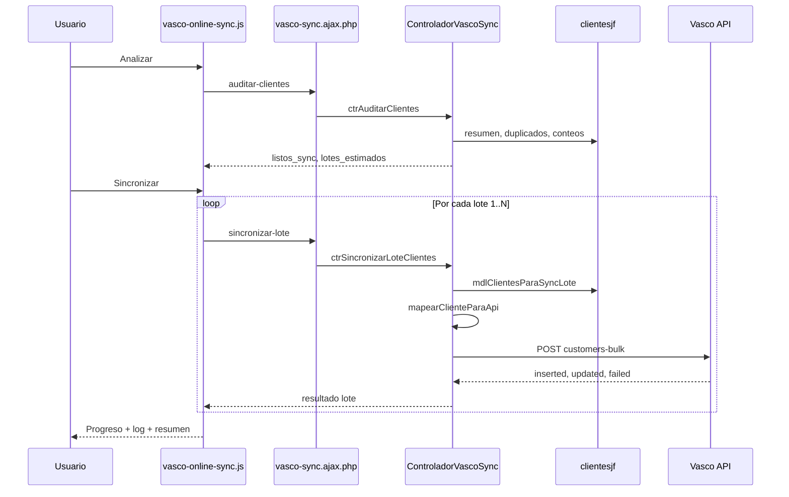

# Vasco Online — Sincronización de clientes (vascorp → internet)

## Descripción

Integración para enviar el maestro de clientes de **vascorp** (`clientesjf`) hacia **Vasco Online** (API en internet). vascorp sigue siendo el sistema de origen; Vasco recibe los datos por HTTP y los guarda con **upsert** por `external_id` (no duplica si reenvías el mismo cliente).

**Menú:** Vasco Online → ruta `sync-vasco`  
**Permiso:** usuario con `backend = 1` en sesión.

---

## Qué hace y qué no hace (hoy)

| Sí | Aún no |
|----|--------|
| Sincronizar **clientes** por lotes de 500 | Productos, vendedores, pedidos |
| Auditar duplicados y bloqueos antes de enviar | `seller_user_id` (vendedor) |
| Probar conexión al API (`GET /health`) | `business_group_code` (grupos) |
| Reintentar lotes fallidos | Sync automática programada |

---

## Idea de negocio

1. En **internet (Vasco)** lo que identifica al cliente es el **documento** (RUC/DNI), no el código interno de vascorp.
2. En vascorp puede haber **varios códigos** con el mismo documento → al enviar se manda **un solo registro por documento** (consolidado).
3. El `external_id` que usa Vasco es el **`id` de `clientesjf`** del registro elegido. Si vuelves a sincronizar el mismo `id`, Vasco **actualiza** el registro existente (idempotente).
4. Se envían clientes **activos e inactivos**:
   - Activo (`estado = 1` y `fecha` cargada) → `state: 1`
   - Cualquier otro → `state: 2`
5. **No se envían** clientes sin documento o con tipo de documento fuera del catálogo SUNAT-06.

---

## Cómo evitamos duplicados

| Capa | Mecanismo |
|------|-----------|
| **vascorp (export)** | Un registro por documento único; si hay varios códigos, se elige el sugerido (activo más reciente, o el más reciente si todos inactivos). |
| **Vasco API** | Upsert por `external_id`. Mismo `id` vascorp = misma fila en Vasco (insert la primera vez, update las siguientes). |
| **Re-sync** | Puedes ejecutar Sincronizar otra vez; no crea copias si el `external_id` no cambió. |

---

## Uso en pantalla (paso a paso)

### 1. Configurar (una vez por entorno)

Ver sección [Configuración](#configuración) más abajo.

### 2. Abrir Vasco Online

Inicio → menú **Vasco Online** (`/sync-vasco`).

### 3. Probar conexión

Botón **Probar** → `GET /health` (sin API key).

- Verde **Conectado** → el servidor vascorp alcanza el API.
- Rojo → revisar URL, Docker/XAMPP, firewall o virtual host.

### 4. Analizar clientes

Botón **Analizar clientes** → consulta `clientesjf` y muestra:

- **Documentos a enviar:** cantidad de documentos únicos válidos (activos + inactivos).
- **Lotes estimados:** `ceil(documentos / 500)`.
- **Duplicados:** mismo documento, varios códigos (informativo; no bloquea el envío).
- **Bloqueados:** sin documento o tipo inválido (no salen en el envío).

Pestañas **Duplicados** y **Bloqueos** en la columna derecha.

### 5. Sincronizar

Botón **Sincronizar** (habilitado si hay documentos a enviar):

1. Genera un `trace_id` por corrida (ej. `vascorp-sync-20260615-143022-a1b2c3`).
2. Envía lote 1, 2, 3… hasta completar (`POST /v2/sync/customers-bulk`).
3. Muestra progreso (lotes y documentos) y escribe en el **Log**.
4. Al terminar: resumen insertados / actualizados.

### 6. Reintentar fallidos

Si un lote falló (red, timeout, HTTP error o respuesta 207 con filas rechazadas), **Reintentar fallidos** vuelve a enviar solo esos lotes con el mismo `trace_id`.

---

## Configuración

### API key (secreto)

Archivo: `controladores/config.php`

```php
define("VASCO_ONLINE_API_KEY", "tu-clave-aqui");
```

Misma convención que `TOKEN_WHATSAPP` y otros tokens del sistema.

### URLs, entorno, lotes y timeout

Archivo: `controladores/vasco-online.config.php`

```php
$vasco_online_entorno = "desarrollo";  // o "produccion"
```

| Entorno | Cuándo | URL típica |
|---------|--------|------------|
| `desarrollo` | vascorp en Docker Mac, API Vasco en otro Docker | `http://host.docker.internal:8084` + header `Host: api.vasco.io` |
| `produccion` | vascorp en XAMPP / servidor Windows | `http://api.vasco.io:8084` (o URL real accesible desde el servidor) |

Otras constantes en el mismo archivo:

| Constante | Valor | Uso |
|-----------|-------|-----|
| `VASCO_ONLINE_SYNC_TIMEOUT` | 120 | Segundos por request cURL |
| `VASCO_ONLINE_MAX_POR_LOTE` | 500 | Máximo clientes por POST (límite del API) |
| `VASCO_ONLINE_ENDPOINT_CLIENTES` | `/v2/sync/customers-bulk` | Endpoint de sync |

### Checklist producción (XAMPP)

1. `$vasco_online_entorno = "produccion"` en `vasco-online.config.php`.
2. API key correcta en `config.php`.
3. El servidor puede resolver y conectar a la URL del API (no uses `host.docker.internal` en producción).
4. PHP con extensión **cURL** habilitada.
5. Probar **Probar** en pantalla antes del primer envío masivo.

---

## Contrato del API (lado Vasco)

Documentación completa del contrato HTTP: proyecto Vasco → `postman/VASCORP_SYNC.md`.

### Health check

```
GET /health
Accept: application/json
```

Sin `Authorization`. Respuesta 200 = API disponible.

### Sync de clientes

```
POST /v2/sync/customers-bulk
Authorization: {API_KEY}          ← valor literal, sin "Bearer"
Content-Type: application/json
```

Body:

```json
{
  "trace_id": "vascorp-sync-20260615-001",
  "batch": 1,
  "customers": [ ... ]
}
```

### Campos que envía vascorp (por cliente)

| Campo API | Origen vascorp | Notas |
|-----------|----------------|-------|
| `external_id` | `clientesjf.id` | Obligatorio. Clave de upsert. |
| `doc_type` | `tipo_documento` | SUNAT-06: `0`, `1`, `4`, `6`, `7`, `A`, `B` |
| `doc_number` | `documento` | Normalizado (mayúsculas, sin espacios) |
| `legal_name` | `nombre` | Si vacío: código o `CLIENTE {id}` |
| `code` | `codigo` | Solo si tiene valor |
| `address` | `direccion` | Opcional |
| `ubigeo` | `ubigeo` | Opcional |
| `phone` | `telefono` | Opcional |
| `email` | `email` | Opcional |
| `state` | calculado | `1` activo, `2` inactivo |

**No se envía hoy:** `seller_user_id`, `business_group_code`, `trade_name`.

### Respuestas

| HTTP | Significado |
|------|-------------|
| 200 | Lote OK |
| 207 | Parcial: algunas filas en `failed[]`, el resto guardado |
| 4xx/5xx | Error del lote; revisar mensaje y log |

Ejemplo éxito:

```json
{
  "status": 200,
  "results": {
    "ok": true,
    "trace_id": "vascorp-sync-...",
    "batch": 1,
    "processed": 500,
    "inserted": 120,
    "updated": 380,
    "failed": []
  }
}
```

---

## Reglas de control en vascorp

### Quién puede sincronizar

- Sesión iniciada (`iniciarSesion = ok`).
- Permiso **Backend** (`$_SESSION["backend"] === 1`).
- Validado en `ajax/vasco-sync.ajax.php` en cada acción.

### Qué clientes entran al export

SQL en `modelos/vasco-sync.modelo.php`:

1. `documento` no vacío.
2. `tipo_documento` en catálogo válido.
3. Agrupación por clave `TIPO:DOCUMENTO` (documento normalizado).
4. Por grupo: un solo `id` (prioridad: activo → `fecreg` desc → `id` asc).

### Qué clientes quedan fuera (bloqueados)

- Sin `documento`.
- `tipo_documento` no válido (ej. valores que no son SUNAT-06).

Estos **no bloquean** el envío del resto: si hay documentos válidos, puedes sincronizar igual.

### Consolidación de duplicados

Si el RUC `20123456789` tiene 3 códigos en vascorp:

- En pantalla ves los 3 en la pestaña Duplicados.
- Al enviar solo sale **1** registro (el ID sugerido marcado en verde).
- Los otros códigos siguen en vascorp; no se borran.

---

## Arquitectura de archivos

```
controladores/
  config.php                    → VASCO_ONLINE_API_KEY
  vasco-online.config.php       → URLs, entorno, timeout, endpoints
  vasco-sync.controlador.php    → Auditoría, health, mapeo, POST por lote

modelos/
  vasco-sync.modelo.php         → Queries clientesjf, export consolidado

ajax/
  vasco-sync.ajax.php           → Endpoints JSON (sesión + permiso)

vistas/
  modulos/vasco-online/sync-vasco.php   → Pantalla
  js/vasco-online-sync.js               → Analizar, probar, sync, progreso
  css/vasco-online-sync.css             → Estilos

index.php                       → require config + vasco-online + controlador/modelo
vistas/plantilla.php            → Ruta sync-vasco, CSS/JS
vistas/modulos/menu.php         → Entrada menú Vasco Online
```

---

## Endpoints AJAX internos

Base: `ajax/vasco-sync.ajax.php`

| Acción | Método | Parámetros | Descripción |
|--------|--------|------------|-------------|
| `auditar-clientes` | GET | — | Resumen, duplicados, advertencias |
| `probar-conexion` | GET | — | Health check al API |
| `sincronizar-lote` | GET | `lote`, `trace_id` (opcional) | Envía un lote (1-based) |

Ejemplo sync lote 2:

```
ajax/vasco-sync.ajax.php?accion=sincronizar-lote&lote=2&trace_id=vascorp-sync-20260615-143022-a1b2c3
```

---

## Flujo técnico de una sincronización



---

## Solución de problemas

| Síntoma | Causa probable | Qué hacer |
|---------|----------------|-----------|
| Connection refused | URL incorrecta desde Docker | `desarrollo` + `host.docker.internal:8084` |
| HTTP 404 HTML "Vasco Admin" | Virtual host Apache | En dev: `VASCO_ONLINE_API_HOST` + header Host |
| API key no configurada | Falta define en config.php | Agregar `VASCO_ONLINE_API_KEY` |
| Lote vacío antes de tiempo | Menos documentos que lotes estimados | Normal al final; el export usa offset real |
| 207 con `failed[]` | Validación fila a fila en Vasco | Revisar `message` por `external_id`; corregir dato en vascorp |
| Timeout | Lote grande o red lenta | Subir `VASCO_ONLINE_SYNC_TIMEOUT`; reintentar lote |

---

## Verificar en Vasco después del sync

Según documentación del API Vasco:

```
GET /v1/customers?linkTo=external_id_customer&equalTo={id}
```

Comprueba que un `external_id` enviado existe y tiene los datos esperados.

---

## Próximos pasos (cuando se necesiten)

1. **Vendedor:** mapear `clientesjf.vendedor` → `seller_user_id` en Vasco (tabla de equivalencias).
2. **Grupos:** crear/sync `business_groups` en Vasco y enviar `business_group_code`.
3. **Otros maestros:** productos, vendedores, pedidos (pestañas ya reservadas en UI).
4. **Sync programada:** cron o tarea Windows que llame al controlador por lotes.

---

## Referencias

- Contrato HTTP Vasco: `../vasco/postman/VASCORP_SYNC.md` (proyecto hermano)
- Ejemplo JSON: `../vasco/postman/samples/vascorp-customers-bulk.json`
- Plantilla Postman: colección Vasco en el repo `vasco`
