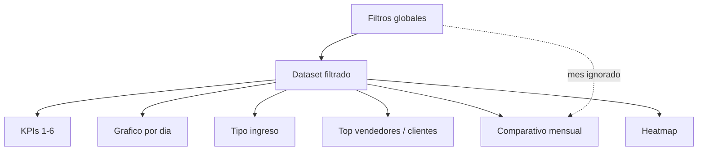

# Cajas del dashboard — resumen

Referencia rápida por bloque del mockup. Cada ítem indica **qué muestra**, **campos de la query** y **agregación típica** (a definir en backend según filtros globales).

---

## Cabecera y filtros globales

| Elemento | Qué hace | Campos / notas |
|----------|----------|----------------|
| Título + «Última actualización» | Identidad y hora de refresco de datos | Metadato de caché o `MAX(cc.fecha)` del período |
| **Año** | Filtra por año calendario | `anno` |
| **Mes** | Filtra por mes | `mes`, `nom_mes` |
| **Vendedor** | Filtra por vendedor | `vendedor` |
| **Tipo ingreso** | Filtra por categoría de pago | `ingreso` (CASE sobre `cod_pago`) |
| **Cliente** | Filtra por cliente | `cliente`, `nombre` |
| **Limpiar filtros** | Reset de filtros a valores por defecto | UI |

Todos los widgets inferiores deben respetar estos filtros (salvo gráficos comparativos multi-año que lo indiquen explícitamente).

---

## Fila superior — KPIs (6 tarjetas)

| # | Caja | Qué muestra | Campos | Agregación / lógica |
|---|------|-------------|--------|---------------------|
| 1 | **Cobranza total** | Suma del mes/período filtrado + % vs mes anterior | `monto`, `mes`, `anno` | `SUM(monto)`; variación vs mismo filtro mes−1 |
| 2 | **Promedio diario** | Promedio de cobranza por día con movimiento | `monto`, `dia`, `fecha` | `SUM(monto) / COUNT(DISTINCT dia)` o días del mes según regla de negocio |
| 3 | **Mejor día del mes** | Día con mayor cobranza + monto | `dia`, `fecha`, `monto`, `nom_mes` | `GROUP BY dia` → `MAX(SUM(monto))`; etiqueta con fecha legible |
| 4 | **Operaciones** | Cantidad de registros de cobranza | filas de la query | `COUNT(*)`; variación vs mes anterior |
| 5 | **Mejor vendedor** | Vendedor top + monto y % del total | `vendedor`, `monto` | Top 1 por `SUM(monto)`; % = monto vendedor / total |
| 6 | **Dev. y descuentos** | Suma de devoluciones y descuentos (negativo) | `ingreso` IN (`DEVOLUCION`, `DESCUENTOS`), `monto` | `SUM(monto)` donde ingreso ∈ esos tipos; tendencia vs mes anterior |

---

## Sección media — tiempo y categoría

| # | Caja | Tipo | Qué muestra | Campos | Agregación |
|---|------|------|-------------|--------|------------|
| 7 | **Cobranza por día del mes** | Barras + línea de promedio | Monto por cada día 1–31 | `dia`, `monto` | `SUM(monto) GROUP BY dia`; línea = promedio diario del KPI 2 |
| 8 | **Cobranza promedio por semana** | Líneas | Promedio por semana del mes (1–5) | `semana_mes`, `rango_semana_mes`, `monto` | `AVG` o `SUM` por `semana_mes` según definición («promedio» del título) |
| 9 | **Tipo de ingreso** | Dona | % EFECTIVO, DEVOLUCION, DESCUENTOS, OTROS | `ingreso`, `monto` | `SUM(monto) GROUP BY ingreso` |

---

## Sección inferior-media — evolución y ranking

| # | Caja | Tipo | Qué muestra | Campos | Agregación |
|---|------|------|-------------|--------|------------|
| 10 | **Evolución acumulada del mes** | Líneas | Curva acumulada día a día: año actual vs anterior + meta | `fecha`, `dia`, `anno`, `monto` | Acumulado: `SUM(monto) OVER (ORDER BY dia)` por `anno`; meta = configuración externa |
| 11 | **Cobranza por mes (comparativo)** | Barras agrupadas | Total por mes: 2025 vs 2026 | `nom_mes`, `mes`, `anno`, `monto` | `SUM(monto) GROUP BY anno, mes`; ignorar filtro de mes; respeta vendedor |
| 12 | **Top 10 vendedores** | Barras horizontales | Ranking por monto cobrado | `vendedor`, `monto` | `SUM(monto) GROUP BY vendedor ORDER BY total DESC LIMIT 10` |

---

## Pie del dashboard — detalle

| # | Caja | Tipo | Qué muestra | Campos | Agregación |
|---|------|------|-------------|--------|------------|
| 13 | **Heatmap cobranzas** | Matriz color | Intensidad por semana del mes × día de semana | `semana_mes`, `nom_dia`, `num_dia_semana`, `monto` | `SUM(monto) GROUP BY semana_mes, nom_dia` |
| 14 | **Top 10 clientes** | Tabla | Cliente, monto, % del total | `nombre`, `cliente`, `monto` | Top 10 por `SUM(monto)`; % sobre total filtrado |
| 15 | **Días sin cobranza** | Gauge / indicador | Cuántos días del mes sin ningún movimiento | `dia`, `fecha` | Días del mes − `COUNT(DISTINCT dia con SUM(monto)<>0)` |
| 16 | **Distribución por documento** | Dona | Boleta, Factura, Nota crédito, Otros | `tipo_doc`, `monto` | Agrupar `tipo_doc` en categorías de negocio; `SUM(monto)` y % |

---

## Navegación lateral (futuro)

| Ítem | Propósito |
|------|-----------|
| Resumen | Vista actual del mockup |
| Cobranza | Detalle / drill-down (por definir) |
| Vendedores | Vista centrada en vendedores |
| Clientes | Vista centrada en clientes |
| Reportes | Exportaciones y reportes |
| **Exportar** | Descarga (Excel/PDF/CSV) según filtros activos |

No bloquea la primera entrega; conviene dejar rutas/placeholders.

---

## Prioridad sugerida para empezar

1. **Filtros + query base** en API/controlador con parámetros año/mes/vendedor/cliente/tipo ingreso.
2. **KPIs 1, 4, 6** — validan totales y conteos rápido.
3. **Gráfico 7** (por día) y **9** (tipo ingreso) — cubren el 80 % del análisis diario.
4. **Top 10 vendedores (12)** y **clientes (14)** — tablas/rankings simples.
5. **Comparativos 10 y 11** — requieren lógica multi-año y acumulados.
6. **Heatmap (13)**, **días sin cobranza (15)**, **documento (16)** — refinamiento visual.

---

## Dependencias entre cajas

